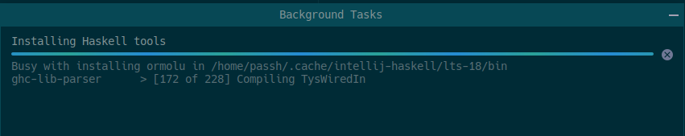

# Pensando en Haskell

## Repo para prácticar con los ejercicios del libro <http://www.cs.us.es/~jalonso/publicaciones/Piensa_en_Haskell.pdf>

De los autores:

José A. Alonso Jiménez <http://www.cs.us.es/~jalonso>

Ma José Hidalgo Doblado <http://www.cs.us.es/~mjoseh>

# Motivación y para quien puede ser util esto

Este repo únicamente te va a servir de algo si eres un **noobskell** como yo , no tienes ni idea de como empezar , ni estas en la uni con esos profesores autores del libro ,  pero andas con ganas de probar este lenguaje de programación puramente funcional y escapar de esa carcel de la P&#127773;&#127773;

Este repo se crea para autodidactas , como el que lo escribe, con la intención de tener una pequeña referencia para los primeros pasos que hay que dar para aprender a programar en Haskell , a veces precisamente lo más dificil es poder configurar un entorno de depuracion amigable y familiarizarse con las herramientas necesarias para conseguir ejecutar algo.

La idea es dejar en este readme los enlaces más interesantes que encuentre y mis propias anotaciones para usarlas como guía , principalmente yo , ya que creo que dificilmente esté interesado , si no es así hazmelo saber con una &#10032; o un pr.


# Links de interés (que intentaré poner con algún orden)

1. Tutorial oficial al instalar ghcup <https://github.com/haskell-beginners-2022/course-plan>
2. <https://typeclasses.com/beginner-crash-course/types-and-functions-1>
3. El libro <http://learnyouahaskell.com/learnyouahaskell.pdf> , que es el de la página , y del que hay un repo en castellano .

-todo: blog de las instrucciones para usar stack .

# Primeros pasos

## Ghcup (Un amigo para siempre)

<https://www.haskell.org/ghcup/>  este programilla es el primero que hay que instalar y da igual el sistema , aunque en la version de win te quedas sin al opción más interesante que tiene , que es precisamente una pequeña interfaz en consola.
De lo que se encarga es precisamente de gestionar esas herramientas básicas necesarias por tí , así como sus versiones.

<https://www.haskell.org/ghcup/steps/> , leer este a fondo , aqui dentro tenemos al final tb resources para aprender bien.

# TLTR IntelliJ

1. instalar con ghcup stack
2. instalar Intellij
3. instalar plugin 
4. Aqui se configura jetbrains://idea/settings?name=Languages+%26+Frameworks--Haskell
5. Esperar mientras instala todas las dependencias por nosotros, lo importante es definirle la ruta del stack 
